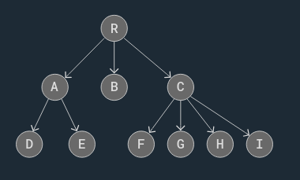

## BFS + Delet method in the trees + pre , in , post order + insertion + أكمل من فيديو محمود سامي 
# Trees

    The tree is non liner data structure which means a single element can have multiple 'next' elements, allowing the data structure to branch out in various directions.

### The Tree data structure can be useful in many cases:

    Hierarchical Data: File systems, organizational models, etc.
    Databases: Used for quick data retrieval.
    Routing Tables: Used for routing data in network algorithms.
    Sorting/Searching: Used for sorting data and searching for data.
    Priority Queues: Priority queue data structures are commonly implemented using trees, such as binary heaps.

### Tree Terminology and Rules:

    Root Node: The first node in a tree.
    parent: A node has links to its child nodes.
    Edge: A link connecting one node to another.
    leaves, or leaf nodes: Nodes without links to other child nodes
    Size: The number of nodes in the tree.
    The height of a node: is the maximum number of edges between the node and a leaf node.
    Depth of a node: is the the number of edges between the node and a root node.
    The tree height: The maximum number of edges from the root node to a leaf node.
    Siblings: The nodes with the same parent node
    Ancestor of a node: All the nodes lead to this node from the root.

### Operations:

    insert
    Delet
    Search
    Traversal: DFS:[in order, post order, pre order]
    Level Order Traversal: BFS

### Types of trees (https://www.geeksforgeeks.org/tree-data-structure/) + (https://www.w3schools.com/dsa/dsa_data_binarytrees.php)
